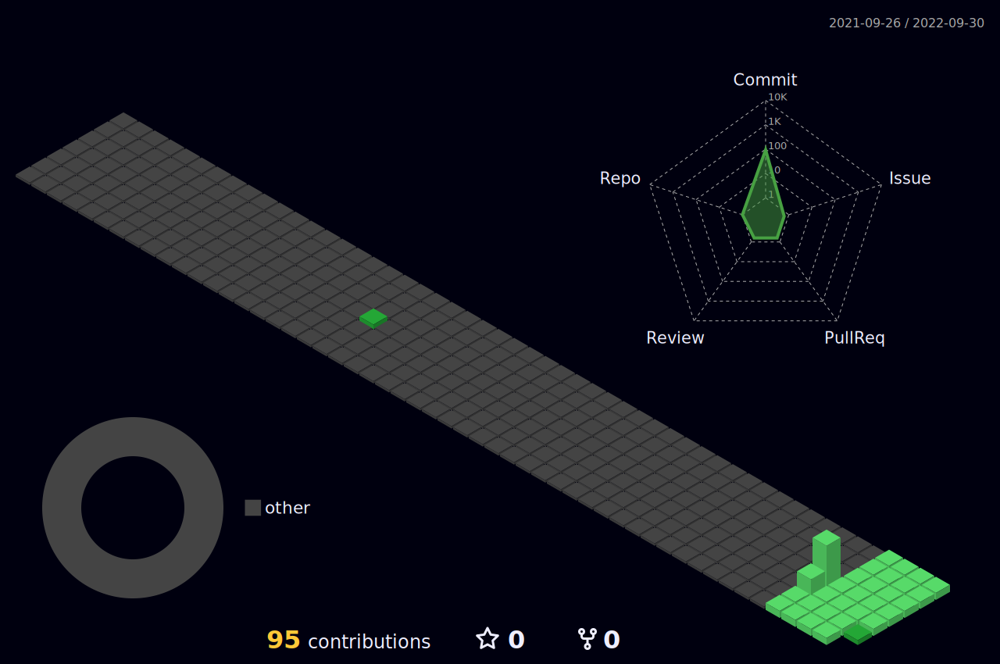

<body>
  

    <h1> Hi there, I'm Muhammad Samiullah👋<a href="#"></h1>
  

	
### I'm a Python Developer and Researcher!
- 🌱 I’m currently expanding my knowledge in Data Science.
- 👯 I’m looking to collaborate with other content creators and developers.
- 📢 Love to teach and inspire students.
- 🥅 2022-23 Goals: Contribute more to Open Source projects and Execute my Innovative ideas.
- 💎 If you are a Tech boy/girl let's get connected  
 
<h2>Tech Stack</h2>

<table width="100">
<tr>
    <td align='center' width="200">
        
    </td>

  <td align='center' width="200">
        
    </td>
 <td align='center' width="200">
        
    </td>
 <td align='center' width="200">
        
    </td>
<td align='center' width="200">
        
    </td>
 
</tr>
 
<tr>
    <td align='center'>
        
    </td>
    <td align='center'>
        
    </td>
 <td align='center'>
        
    </td>
 <td align='center'>
        
    </td>
<td align='center'>
        
    </td>
</tr>
    
</table>

 

 
 

	
 
 <h2>GitHub Analytics
 </h2>

  

 
	
## ⚡️Github Contributions
	
<h4 align="center">Isometric view of contributions in the last year</h4>

	

## 🚀Github Metrics

	

 

## 🐛Github Magic Game

  

 
<h2 >🏆 GitHub Profile Trophy</h2>

 
  Views 
  

